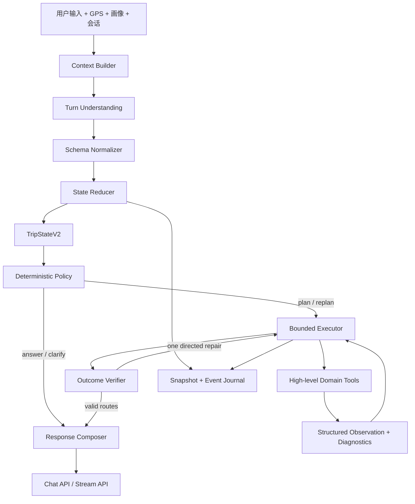

# AI 出行规划 Agent Harness V3 架构介绍

> 文档类型：当前实验架构与演进边界  
> 适用分支：`codex/travel-agent-harness-v3`  
> 日期：2026-08-21  
> 版本结果：[Harness V3 版本说明](./agent_harness_v3_version_notes_20260821.md)

## 1. 架构定位

Harness V3 不是把出行规划改造成一个无限自治 Agent，也不是更换现有路线算法。它是在模型与业务系统之间增加一层可靠的工程控制面：模型负责理解开放语言，Harness 负责状态、权限、约束、执行预算、错误恢复和结果验证，领域工具负责计算可复现的路线事实。

适合本产品的形态是：

> **单一主 Agent + 结构化状态 + 少量高层领域工具 + 有界执行循环 + 确定性验证器。**

这与 Codex、Claude 等可靠 Agent 的共同设计思想一致：给模型清晰的环境反馈和可操作工具，同时把终止条件、权限、持久状态、验证与回滚留在 Harness 中。我们借鉴的是这种控制哲学，而不是照搬编程 Agent 的 SDK 或多 Agent 拓扑。

## 2. 产品目标

架构直接服务于以下用户体验：

- 用户说了地点时，以用户明确地点为准；否则依次使用历史明确地点、GPS、画像、推断和默认值。
- 能生成 3 条路线时返回 3 条；只有 1～2 条合法路线时返回已有路线，不用空结果掩盖部分成功。
- 行程覆盖饭点时合理安排正餐；用户明确吃过或不需要时不强加。
- 支持多轮追加、删除、替换和局部重规划，不丢失未被修改的状态。
- LLM 总结、地图或部分交通腿失败时安全降级，不向用户暴露异常、堆栈或密钥。
- 每次失败都能定位到理解、状态、决策、工具、恢复、验证中的具体阶段。

## 3. 总体结构

主链路只有一个权威理解结果和一个权威旅行状态。工具不会暗中修改状态，模型输出也不能绕过 Reducer、Policy 和 Verifier 直接成为用户结果。

## 4. 职责边界

| 层 | 负责 | 不负责 |
| --- | --- | --- |
| 模型 | 开放语言语义、指代、候选 Patch、解释文本 | 最终状态覆盖、权限判断、重试次数、硬约束真值 |
| Schema Normalizer | 类型兼容、枚举归一、旧格式转换 | 猜测完整用户意图 |
| State Reducer | 来源优先级、增量合并、版本和证据 | 搜索 POI、生成路线 |
| Policy | answer/clarify/plan/replan/reject 决策 | 自由生成长计划 |
| Executor | 有界 Plan–Act–Observe、预算、终止和恢复 | 修改用户明确硬约束 |
| 领域工具 | 地点解析、POI、路线、LYNN、诊断 | 会话管理和自然语言追问 |
| Verifier | 城市、地点、时间、预算、营业、交通腿和必需角色校验 | 美化回复 |
| Composer | 忠实表达已验证结果和降级信息 | 发明路线事实 |

这个边界解决了旧架构最核心的问题：同一个字段不再由 Prompt、正则、Session、路线服务和回复层竞争写入。

## 5. 核心数据契约

### 5.1 TripStateV2

每个重要字段都保存：

- `value`：规范化后的值；
- `source`：用户明确、历史明确、GPS、画像、推断或默认；
- `confidence`：理解置信度；
- `turn_id`：产生该值的轮次；
- `relaxability`：是否允许自动放宽；
- `evidence`：支持该值的原始文本或外部证据。

地点统一使用 `LocationRef`，将名称、城市、坐标和精度作为一个整体更新。用户明确更换起点时，旧地点的坐标不会残留并覆盖新地点。

### 5.2 TurnUnderstanding

每轮只产生一个结构化结果：

- 轮次类型；
- 增量 `StatePatch`；
- 指代目标；
- 类型化 `AmbiguitySignal`；
- 字段证据和置信度。

模型解析失败时只修复一次，仍失败则进入确定性字段 fallback。规则负责校验和兜底，不再生成第二份完整 Intent。

### 5.3 ContextualNeed

午餐、晚餐等需求不是普通关键词偏好，而是由时间窗、行程长度、用户否定和已有安排共同决定的上下文约束。`ContextualNeedEngine` 是这些规则的唯一来源，并将结果投影为路线所需角色。

### 5.4 ToolResult

工具返回结构化状态，而不是依靠异常文字猜原因：

- `success`
- `partial`
- `infeasible`
- `retryable_error`
- `fatal_error`
- `invalid_input`

结果同时包含错误码、诊断、耗时、是否可重试和建议动作。路线工具还应提供硬约束拒绝直方图，使恢复动作有事实依据。

## 6. 关键不变量

以下规则应由代码和测试保证，而不是依赖 Prompt 自觉遵守：

1. 地点来源优先级：用户明确 > 历史明确 > GPS > 画像 > 推断 > 默认值。
2. 模型格式波动不能导致 Reducer 或 API 崩溃。
3. 只有真正阻断规划的问题才追问。
4. 用户明确预算、城市、时间和必含站点不得被静默放宽。
5. 饭点规则只有一个权威计算入口。
6. 存在 1～2 条已验证路线时必须返回，不因凑不够 3 条而清空。
7. 相同参数不得机械重试；每次重试必须有新诊断或参数变化。
8. 未通过 Verifier 的路线不得返回。
9. LLM 总结失败不影响路线数据返回。
10. 用户可见内容不得包含原始异常、堆栈、隐藏推理或密钥。

## 7. 有界执行与诊断恢复

每轮最多执行 5 个工具步骤，路线生成最多 3 次。一次典型执行为：

1. 根据当前状态选择高层工具。
2. 执行工具并取得结构化 Observation。
3. 判断是成功、部分成功、业务无解还是依赖错误。
4. 仅在有新信息时采取一次针对性恢复。
5. 达到预算、连续两次无新信息或得到已验证结果时停止。

恢复策略按原因选择：

| 诊断 | 恢复动作 |
| --- | --- |
| 候选 POI 确实不足 | 扩大召回或调整合法类别 |
| 三站组合无解 | 最少站点 `3 → 2 → 1` |
| 营业时间冲突 | 调整站点或时间顺序 |
| 总时长超限 | 减少站点或选择更紧凑候选 |
| 默认/推断偏好导致无解 | 自动放宽并记录 degradation |
| 用户明确硬约束导致无解 | 精准追问，等待授权 |

当前分支已经实现诊断驱动的最少站点恢复；统一约束集合和更细的营业时间、预算恢复仍是下一阶段重点。

## 8. 为什么它不是 Case-by-case 修复

Case-by-case 修复通常把一句话、一个地点或一条评测写进正则或 Prompt。Harness V3 的改动单位是“失败类型”：

| 失败类型 | 架构级机制 | 可覆盖范围 |
| --- | --- | --- |
| 模型字段格式不稳定 | Schema 边界归一化 | 所有结构化字段和模型版本 |
| 过度追问 | 类型化歧义 + 确定性 Policy | 所有可默认、可推断场景 |
| 偏好同义词漏识别 | Canonical taxonomy | 所有同义表达和前后端消费者 |
| 饭点安排混乱 | ContextualNeedEngine | 所有时间窗和明确否定组合 |
| 零路线机械重试 | 诊断驱动恢复 | 所有业务无解原因 |
| 中间步骤不可见 | 结构化 Trace 与终态评测 | 所有批量 Query 和线上请求 |

新增一个城市、换一个模型或扩展一批 Query 时，这些机制仍然成立；这才是本轮提升能够持续的原因。

## 9. 评测与可观测性

评测以最终状态和已验证结果为主，不要求 Agent 复刻唯一工具路径。过程断言只用于安全和架构不变量，例如：不得放宽明确硬约束、不得同参数重试、不得绕过 Verifier。

Eval V3 应同时记录：

- Golden Patch 与 Golden State；
- 决策终态和必要追问；
- 工具选择、诊断与恢复动作；
- 路线硬约束和偏好满足情况；
- `pass@1` 与 `stable-pass@3`；
- 模型、Prompt、数据、策略和代码版本。

当前 30 条数据集覆盖理解、定位、隐式需求、多轮状态、规划质量和鲁棒性。它已经能将剩余失败统一定位到路线层，但仍需扩展城市、地图异常、长会话和属性测试。

## 10. 当前实现与下一步

### 已实现

- `TripStateV2`、增量 Reducer 和地点来源优先级。
- 类型化理解结果、Schema 兼容和确定性 Policy。
- `ContextualNeedEngine` 与 canonical taxonomy。
- 标准工具结果、诊断驱动的有限恢复。
- V2 批量评测、结构化 Trace 和终态评分。
- V1/V2 兼容，保留 LYNN 和现有路线服务。

### 下一步

1. 建立统一 `ConstraintSet`，让候选生成、路线组合、验证和最终选择使用同一时长、预算、营业时间口径。
2. 把低层工具收敛为 `ground_trip / plan_itinerary / repair_itinerary` 等高层领域动作，降低模型选择负担。
3. 增加 `PlanningJournal`，显式记录假设、动作、Observation、验证和恢复依据。
4. 建立最终选路不变量，修复已经产生候选但 `selected_route_count=0` 的漏斗断层。
5. 对 30 条主集运行 `stable-pass@3`，再增加变形测试、故障注入和 Shadow 对比。

## 11. 兼容、启用与回退

- V1 在正式门禁通过前保持可用。
- V2 通过 `AGENT_RUNTIME_VERSION` 切换，可先运行 Shadow 再逐步灰度。
- `/api/chat`、流式接口和前端现有字段保持兼容；V2 信息通过可选字段增加。
- LYNN 继续作为路线工具内部的召回和排序策略，不被 Harness 重写。
- 实验失败时切回 `keykii` 或 `AGENT_RUNTIME_VERSION=v1`，不需要破坏状态或删除数据。

## 12. 设计参考

本架构参考的是可靠 Agent 的工程方法，而非特定 SDK：

- OpenAI, [Harness engineering: leveraging Codex in an agent-first world](https://openai.com/index/harness-engineering/)
- OpenAI, [Unrolling the Codex agent loop](https://openai.com/index/unrolling-the-codex-agent-loop/)
- Anthropic, [Effective context engineering for AI agents](https://www.anthropic.com/engineering/effective-context-engineering-for-ai-agents)
- Anthropic, [Writing effective tools for agents](https://www.anthropic.com/engineering/writing-tools-for-agents)
- Anthropic, [Demystifying evals for AI agents](https://www.anthropic.com/engineering/demystifying-evals-for-ai-agents)

取舍结论：采用清晰环境、结构化工具反馈、有界循环、持久状态和验证优先；不采用无限循环、隐藏状态、多 Agent 互相讨论或为了框架而重写成熟业务服务。

